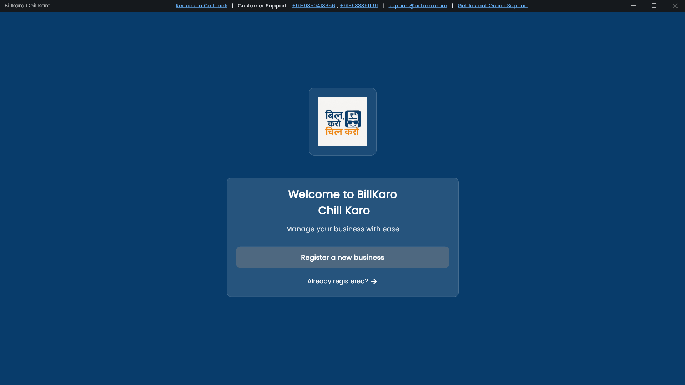
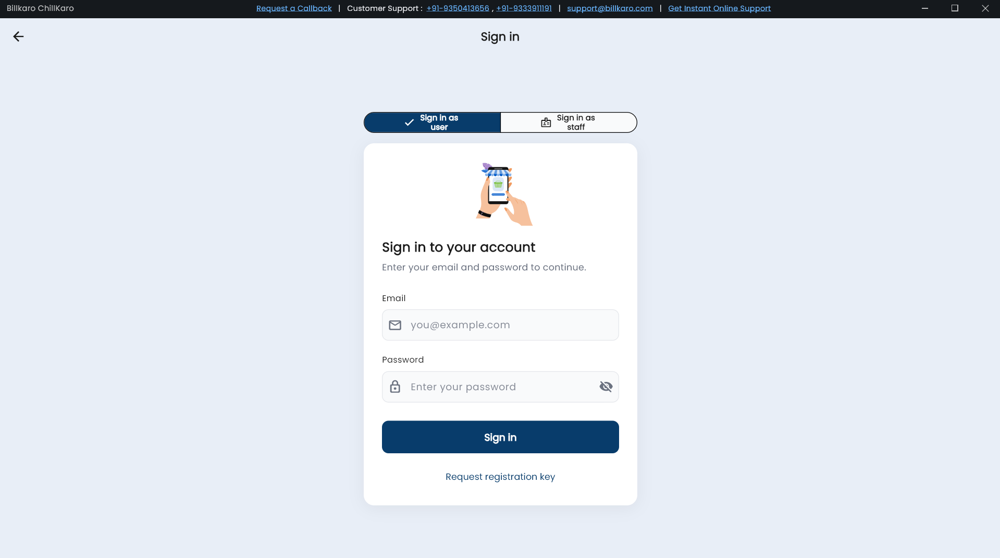
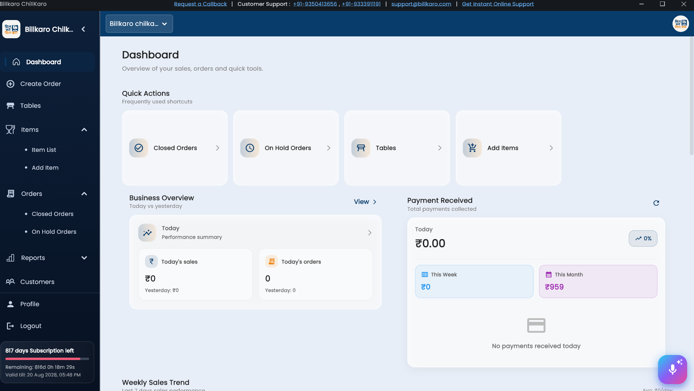
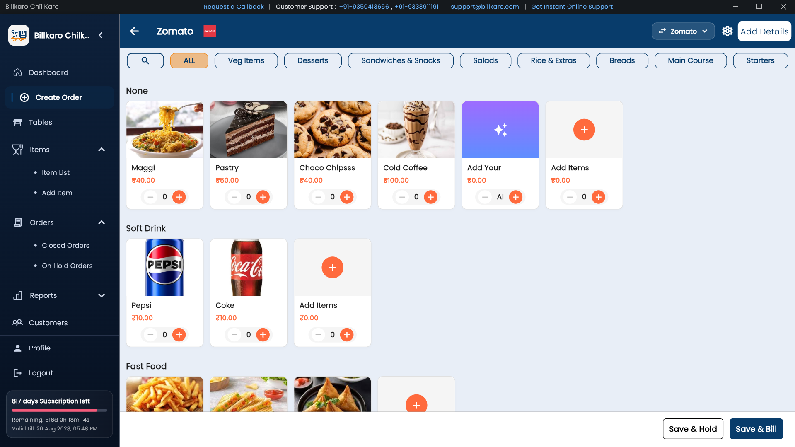
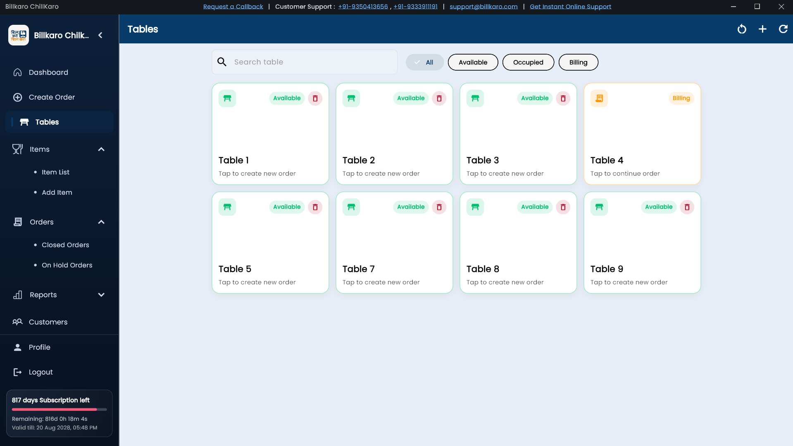
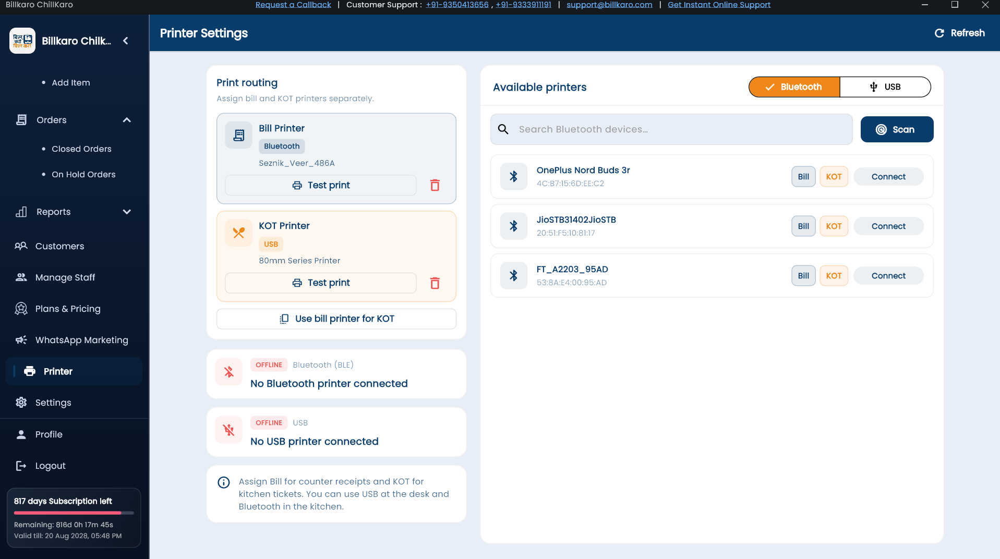
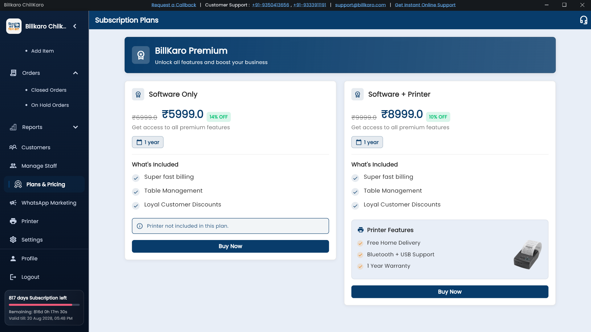

# billkaro_windows

A new Flutter project.

## Running on Windows

The project includes Windows desktop support. To run on Windows:

1. **Enable Windows desktop** (one-time):
   ```powershell
   flutter config --enable-windows-desktop
   ```

2. **Install dependencies**:
   ```powershell
   flutter pub get
   ```

3. **Run the app**:
   ```powershell
   flutter run -d windows
   ```
   Or use the script: `.\run_windows.ps1`

**From Cursor/VS Code:** Use the Run and Debug panel (F5), select a Flutter configuration, and set the device to **Windows** in the status bar, or run in terminal: `flutter run -d windows`.

**Note:** Some features (e.g. WorkManager background sync, Bluetooth thermal printer) may be unavailable or limited on Windows; the app will still run and other features will work.

## Screenshots

### Dashboard and Sales Overview
Main dashboard showing quick actions and a snapshot of business performance.



### Product and Inventory Management
Screen used to add, edit, and monitor product inventory details.



### Billing and Checkout Workflow
Billing interface for creating invoices and completing customer checkout.



### Customer and Order Tracking
View customer records and track order history from a single screen.



### Reports and Analytics
Detailed reports section for sales, profit, and trend analysis.



### Printing and Receipt Preview
Receipt preview and printer integration flow for final bill printing.



### Settings and Configuration
Application settings for shop profile, preferences, and system options.



## Getting Started

This project is a starting point for a Flutter application.

A few resources to get you started if this is your first Flutter project:

- [Lab: Write your first Flutter app](https://docs.flutter.dev/get-started/codelab)
- [Cookbook: Useful Flutter samples](https://docs.flutter.dev/cookbook)

For help getting started with Flutter development, view the
[online documentation](https://docs.flutter.dev/), which offers tutorials,
samples, guidance on mobile development, and a full API reference.
